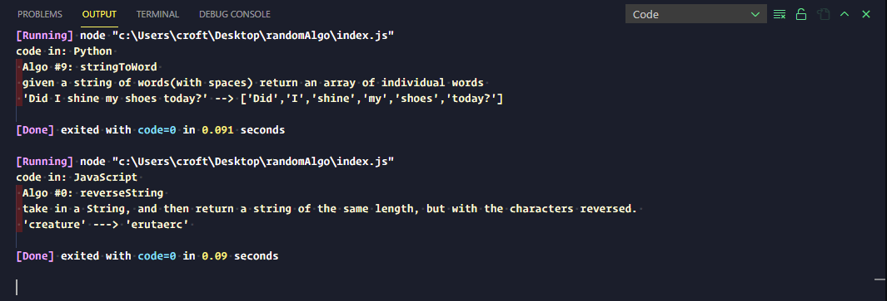

<div id="top"></div>


<!-- PROJECT SHIELDS -->
[![LinkedIn][linkedin-shield]][linkedin-url]

<!-- PROJECT LOGO -->
<br />

<div align="center">
  <a href="./assets/randomAlgo.PNG">
    
  </a>
 </div>
 
<h3 align="center">randomAlgo</h3>

<p align="center">
This is a growing library of algorithms for practice. Run the function to get a random algorithm and a random language to perform the algorithm in.
</p>

<!-- ABOUT THE PROJECT -->

## About The Project

<p> My first portfolio site. This website utilizes popular UI design patterns such as Neumorphism and Glassmorphism along with popular JavaScript libraries with jQuery.js and typed.js.
</p>


<p align="right">(<a href="#top">back to top</a>)</p>

### Built With

- HTML5
- CSS3
- JavaScript
- [jQuery.js](https://jquery.com/)
- [typed.js](https://github.com/mattboldt/typed.js/)
- [DevIcons](https://devicon.dev/)
- [FontAwesome](https://fontawesome.com/v5.15/icons)

<p align="right">(<a href="#top">back to top</a>)</p>

### Installation

```
Download code.

run index.js

in the console will be your algorithm
for the day and the language to use.

```

<p align="right">(<a href="#top">back to top</a>)</p>

<!-- LICENSE -->

## License

Distributed under the MIT License. See `LICENSE.txt` for more information.

<p align="right">(<a href="#top">back to top</a>)</p>

<!-- CONTACT -->

## Contact

Johnathan Croft - [@devJohnathan](https://twitter.com/devJohnathan) - croftmjohn@gmail.com

Project Link: [https://github.com/jmcroft7/randomAlgo](https://github.com/jmcroft7/randomAlgo)

<p align="right">(<a href="#top">back to top</a>)</p>

<!-- MARKDOWN LINKS & IMAGES -->

[linkedin-shield]: https://img.shields.io/badge/-LinkedIn-black.svg?style=for-the-badge&logo=linkedin&colorB=555
[linkedin-url]: https://www.linkedin.com/in/devjohnathan/
